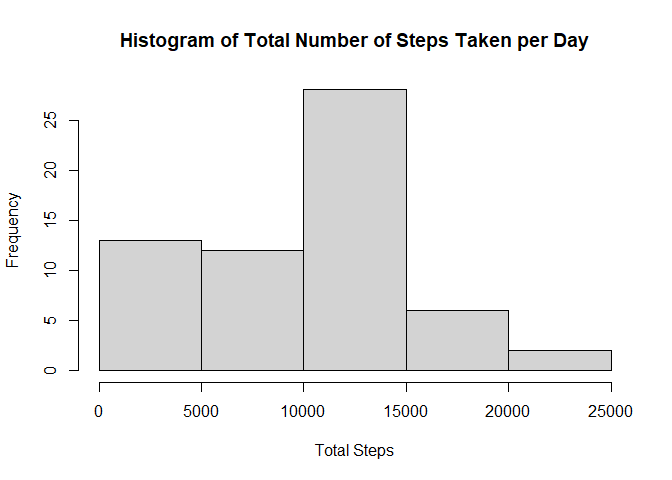
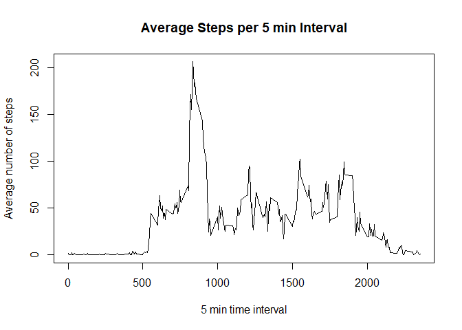
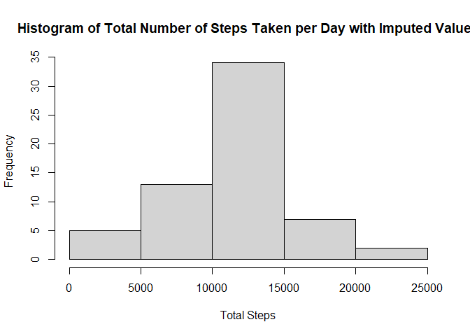
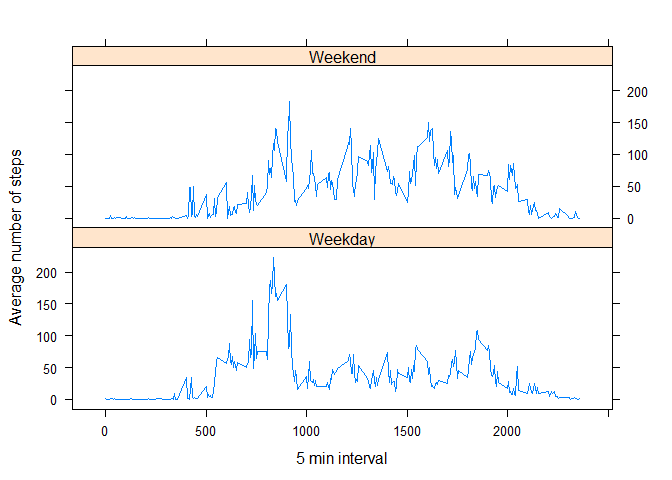

```r
knitr::opts_chunk$set(echo=TRUE)
```


```r
library(dplyr)
library(lubridate)
library(mice)
```


## Loading and preprocessing the data

```r
activity_df <- read.csv(unz("activity.zip", 'activity.csv'))

activity_df <- activity_df %>% mutate(date= ymd(date))
```

## What is mean total number of steps taken per day?


```r
tot_steps_day <- activity_df %>% group_by(date) %>%
                            summarise(tot_day = sum(steps, na.rm=TRUE))
```

```
## `summarise()` ungrouping output (override with `.groups` argument)
```

```r
hist(tot_steps_day$tot_day, main="Histogram of Total Number of Steps Taken per Day", xlab="Total Steps")
```

<!-- -->


```r
mean_steps_per_day <- mean(tot_steps_day$tot_day, na.rm=TRUE)
median_steps_per_day <- median(tot_steps_day$tot_day, na.rm=TRUE)
```


- Mean number of steps taken per day: 9354.2295082
- Median number of steps taken per day: 10395


## What is the average daily activity pattern?


```r
avg_pattern_day <- activity_df %>% group_by(interval) %>%
                                   summarise(avg_steps = mean(steps, na.rm=TRUE))
```

```
## `summarise()` ungrouping output (override with `.groups` argument)
```


```r
plot(avg_pattern_day$interval, 
     avg_pattern_day$avg_steps, type="l", 
     main="Average Steps per 5 min Interval",
     xlab="5 min time interval",
     ylab= "Average number of steps")
```

<!-- -->


```r
max_interval <- avg_pattern_day %>% ungroup() %>%
                                    filter(avg_steps==max(avg_steps)) %>%
                                    pull(interval)
```


The interval which had the highest average number of steps was between 835 and 840

## Imputing missing values

Impute values using multivariate imputation by chained equations(mice)


```r
total_na <- sum(is.na(activity_df))
Imp_activity_df <- mice(activity_df %>% select(-date), method="pmm")
```

```
## 
##  iter imp variable
##   1   1  steps
##   1   2  steps
##   1   3  steps
##   1   4  steps
##   1   5  steps
##   2   1  steps
##   2   2  steps
##   2   3  steps
##   2   4  steps
##   2   5  steps
##   3   1  steps
##   3   2  steps
##   3   3  steps
##   3   4  steps
##   3   5  steps
##   4   1  steps
##   4   2  steps
##   4   3  steps
##   4   4  steps
##   4   5  steps
##   5   1  steps
##   5   2  steps
##   5   3  steps
##   5   4  steps
##   5   5  steps
```

```r
Imp_activity_df <- complete(Imp_activity_df)

activity_df_complete <- Imp_activity_df %>% mutate(date=activity_df$date)
```


```r
tot_steps_day_imp <- activity_df_complete %>% group_by(date) %>%
                            summarise(tot_day = sum(steps, na.rm=TRUE))
```

```
## `summarise()` ungrouping output (override with `.groups` argument)
```

```r
hist(tot_steps_day_imp$tot_day, main="Histogram of Total Number of Steps Taken per Day with Imputed Values", xlab="Total Steps")
```

<!-- -->


```r
mean_steps_per_day_imp <- mean(tot_steps_day_imp$tot_day, na.rm=TRUE)
median_steps_per_day_imp <- median(tot_steps_day_imp$tot_day, na.rm=TRUE)
```


- Mean number of steps taken per day after imputation: 1.0971754\times 10^{4}
- Median number of steps taken per day after imputation: 11162


The mean number of steps 17.2919062% higher than the pre-imputed values.
The median number of steps is roughly in line with the median of the pre-imputed values.


## Are there differences in activity patterns between weekdays and weekends?


```r
activity_df_complete <- activity_df_complete %>% mutate(weekday_ind = ifelse(weekdays(date) %in% c("Saturday", "Sunday"), "Weekend", "Weekday"))

avg_weekday_df <- activity_df_complete %>% group_by(interval, weekday_ind) %>%
                                           summarise(avg_steps = mean(steps,na.rm = TRUE))
```

```
## `summarise()` regrouping output by 'interval' (override with `.groups` argument)
```
                                                        


```r
xyplot(avg_steps~interval|weekday_ind, 
       data=avg_weekday_df, 
       type='l', 
       layout=c(1,2), 
       xlab="5 min interval",
       ylab="Average number of steps")
```

<!-- -->
